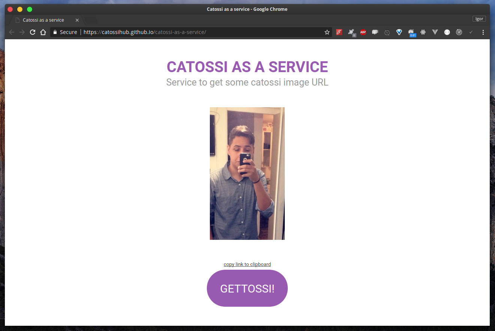

  <h3 align="center">Catossi as a service</h3>
  
Service to get some catossi image URL.

[DEMO](https://catossihub.github.io/catossi-as-a-service/)

---

Now it's much easier to make fun of the catossi, with the catoss as a service you can share links of bad photos of catossi and have fun with your friends!

### License

GPLv3
